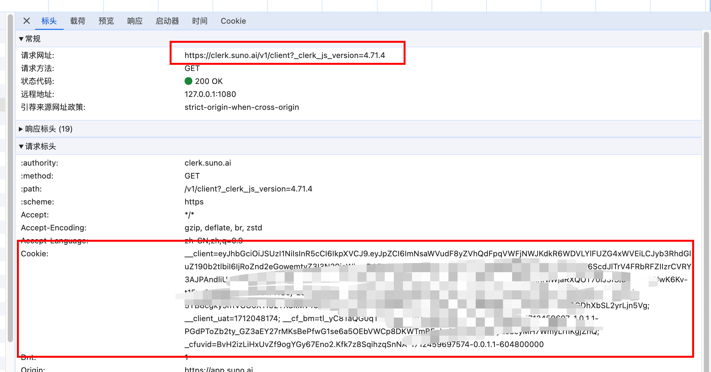

# suno-api-go

注：suno目前没有go的sdk调用，这个是按照官方web请求封装的一个sdk

## Installation

```
# Go Modules
require github.com/yaobg/suno-api-go
```

## Usage

The following samples will assist you to become as comfortable as possible with resty library.

```api
// Import resty into your code and refer it as `suno`.
import "github.com/yaobg/suno-api-go"
```

## cookie



## Example

### 账户信息

```go
package main

import (
	"fmt"
	suno "github.com/yaobg/suno-api-go"
)

var cookie = os.Getenv("suno_cookie")

const proxy = "http://127.0.0.1:1080"

// TestBillingInfo 账户信息
func TestBillingInfo(t *testing.T) {
	c := NewClient(Config{
		TimeOut: 10,
		Proxy:   proxy,
		Cookie:  cookie,
	})
	resp, err := c.BillingInfo()
	if err != nil {
		panic(err)
	}
	fmt.Printf("%+v", resp)
}

```

### 生成歌曲

```go
package main

import (
	"fmt"
	suno "github.com/yaobg/suno-api-go"
	"time"
)

func TestGenerateByPrompt(t *testing.T) {
	c := NewClient(Config{
		TimeOut: 10,
		Proxy:   proxy,
		Cookie:  cookie,
	})
	generate, err := c.Generate(GenerateRequest{
		Prompt:           "(Verse 1)\nWoke up this morning with dreams on my mind,\nChasing all the stars, but you're the one that I find.\nDiamonds and gold, they mean nothing at all,\nIf I ain't got you, I’m destined to fall.\n(Pre-Chorus)\nFame and fortune, they can come and they can go,\nBut your love's the only truth I know.\nIn a world full of glittering lies,\nYou're my solace, my endless skies.\n(Chorus)\nIf I ain't got you, it all means nothing,\nYou're my treasure, my heart's true loving.\nIf I ain't got you, it's a world so hollow,\nIn your eyes, my dreams I follow.\n(Verse 2)\nTravelled the world, seen everything’s glow,\nBut home is where you are, and that's all I need to know.\nEvery beat of my heart belongs to you,\nWithout your love, I don't know what I'd do.\n(Pre-Chorus)\nFame and fortune, they can come and they can go,\nBut your love's the only truth I know.\nIn a world full of glittering lies,\nYou're my solace, my endless skies.\n(Chorus)\nIf I ain't got you, it all means nothing,\nYou're my treasure, my heart’s true loving.\nIf I ain't got you, it's a world so hollow,\nIn your eyes, my dreams I follow.\n(Bridge)\nAll the money in the world can’t buy\nThe feeling of a love so high,\nAnd every breath I take, I take for you,\nIn your arms, I find what’s true.\n(Chorus)\nIf I ain't got you, it all means nothing,\nYou’re my treasure, my heart’s true loving.\nIf I ain't got you, it's a world so hollow,\nIn your eyes, my dreams I follow.\n(Outro)\nIf I ain't got you, I’ve got no tomorrow,\nFor your love, I'd trade all my sorrow.\nIf I ain't got you, it all fades away,\nWith you, my love, forever I’ll stay.",
		Mv:               "chirp-v3-0",
		MakeInstrumental: false,
		Title:            "乡村音乐",
		Tags:             "emotional rap",
	})
	if err != nil {
		return
	}
	var (
		ids         []string
		completeMap = make(map[string]interface{})
		channel     = make(chan struct{})
	)
	for _, v := range generate.Clips {
		ids = append(ids, v.Id)
	}
	tm := time.NewTimer(2 * time.Second)
	go func() {
		defer close(channel)
		for {
			if len(completeMap) == len(ids) {
				break
			}
			task, err := c.GenerateTask(ids)
			if err != nil {
				panic(err)
			}
			if task == nil {
				panic("task is nil")
			}
			for _, v := range task {
				// 表示完成
				if v.Status == Complete {
					completeMap[v.Id] = v
				}
			}
			select {
			case <-tm.C:
				continue
			}
		}
	}()
	<-channel
	fmt.Printf("%+v", completeMap)
}

```

### 歌词优化

```go
package main

import (
	"fmt"
	suno "github.com/yaobg/suno-api-go"
	"time"
)

func TestGenerateLyrics(t *testing.T) {
	c := NewClient(Config{
		TimeOut: 10,
		Proxy:   proxy,
		Cookie:  cookie,
	})
	id, err := c.GenerateLyrics("Verse 1:\\n在黑暗的深渊里\\n我心中的火焰燃烧\\n肆意挥洒着狂野的力量\\n毫不畏惧,勇往直前\\n\\nChorus:\\n狂风呼啸,雷电交加\\n潜藏在内心的怒火释放\\n无尽的痛苦,无尽的恐惧\\n唯有摇滚乐撼动心魂")
	if err != nil {
		panic(err)
	}
	if id == "" {
		panic("id is empty")
	}
	var (
		lyricsInfo *GenerateLyricsResponse
		channel    = make(chan struct{})
	)
	go func() {
		defer close(channel)
		for {
			resp, err := c.GetFormatLyrics(id)
			if err != nil {
				return
			}
			if resp.Status == Complete {
				lyricsInfo = resp
				break
			}
		}
	}()
	<-channel
	if lyricsInfo != nil {
		fmt.Printf("title %s,text %s", lyricsInfo.Title, lyricsInfo.Text)
	}
}

```
### 歌曲extend
```go
package main

import (
	"fmt"
	suno "github.com/yaobg/suno-api-go"
	"time"
)

func TestExtendMusic(t *testing.T) {
	c := NewClient(Config{
		TimeOut: 10,
		Proxy:   proxy,
		Cookie:  cookie,
	})
	generate, err := c.Generate(GenerateRequest{
		Prompt:         "[Verse]\n在田野里漫步\n看着风儿轻轻吹过\n远方的山峦消失在云雾里\n我心中的宁静永不磨灭\n\n[Verse 2]\n河水流淌在田野间\n闪烁着金色的阳光\n大地为我敞开怀抱\n欢迎我去感受大自然\n\n[Chorus]\n这就是我爱上的田野风光\n大自然的韵律让我心生憧憬\n在这片广袤的土地上\n我找到了属于我的快乐",
		Mv:             "chirp-v3-0",
		Title:          "乡村音乐",
		Tags:           "emotional rap",
		ContinueClipId: "6b704b7f-3629-431e-b1e8-1d532a92d448",
		ContinueAt:     120,
	})
	if err != nil {
		return
	}
	var (
		ids         []string
		completeMap = make(map[string]interface{})
		channel     = make(chan struct{})
	)
	for _, v := range generate.Clips {
		ids = append(ids, v.Id)
	}
	tm := time.NewTimer(2 * time.Second)
	go func() {
		defer close(channel)
		for {
			if len(completeMap) == len(ids) {
				break
			}
			task, err := c.GenerateTask(ids)
			if err != nil {
				panic(err)
			}
			if task == nil {
				panic("task is nil")
			}
			for _, v := range task {
				// 表示完成
				if v.Status == Complete {
					completeMap[v.Id] = v
				}
			}
			select {
			case <-tm.C:
				continue
			}
		}
	}()
	<-channel
	fmt.Printf("%+v", completeMap)
}
```
